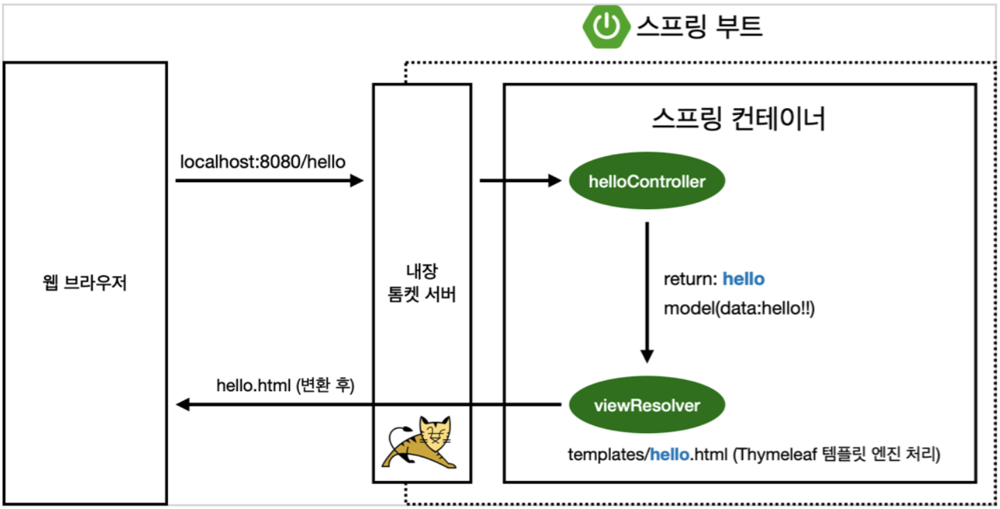

# Spring Study

> 스프링 완전 정복 로드맵 참고 (김영한)

## 시작 전,
https://start.spring.io/ <- 에서 프로젝트 설정하면 편함

Project Type - 버전 설정과 필요한 library를 당겨와 빌드하는 라이프사이클 관리 툴
- Maven - 대부분의 legacy project들
- Gradle - 요즘 추세

### Dependencies

**스프링 부트 라이브러리**
- spring-boot-starter-web
  - spring-boot-starter-tomcat: 톰캣 (웹서버)
  - spring-webmvc: 스프링 웹 MVC 
- spring-boot-starter-thymeleaf: 타임리프 템플릿 엔진(View)
- spring-boot-starter(공통): 스프링 부트 + 스프링 코어 + 로깅
  - spring-boot
    - spring-core
  - spring-boot-starter-logging -> 현업에서는 sysout 대신 log 사용 (로그 수집/관리 목적)
    - logback, slf4j
    
**테스트 라이브러리**
- spring-boot-starter-test
  - junit: 테스트 프레임워크
  - mockito: 목 라이브러리
  - assertj: 테스트 코드를 좀 더 편하게 작성하게 도와주는 라이브러리 
  - spring-test: 스프링 통합 테스트 지원
  
### View 설정
- https://spring.io/
  - Spring은 그 내용이 방대해 공식 문서에서 잘 찾아가면서 사용해야 함
- https://www.thymeleaf.org/ - thymeleaf 사용

**동작 환경**

컨트롤러에서 리턴 값으로 문자를 반환하면 뷰 리졸버(viewResolver)가 화면을 찾아서 처리
- 스프링 부트 템플릿엔진 기본 viewName 매핑
- resources:templates/ +{ViewName}+ .html

> 참고: spring-boot-devtools 라이브러리를 추가하면, html 파일을 컴파일만 해주면 서버 재시작 없이 View 파일 변경이 가능하다.
> 
> 인텔리J 컴파일 방법: 메뉴 build