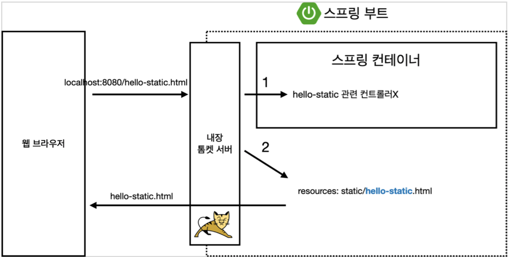
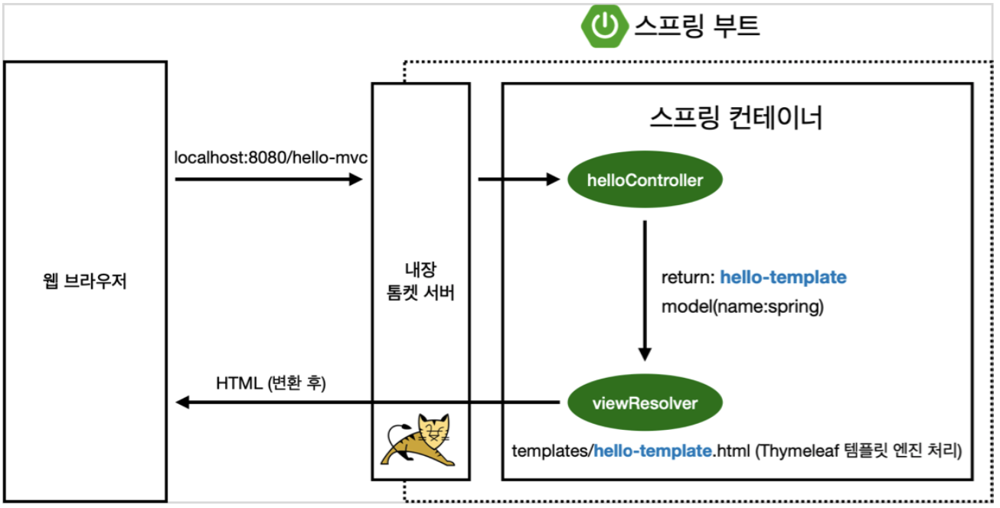
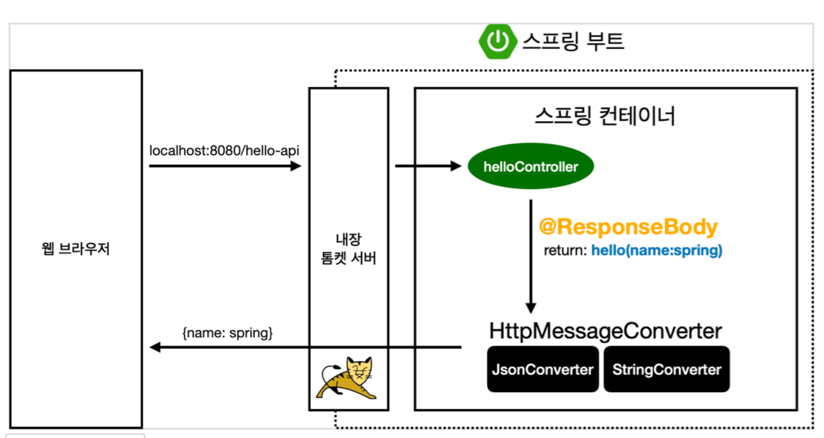

# Spring Study

> 스프링 완전 정복 로드맵 참고 (김영한)

## 시작 전,
https://start.spring.io/ <- 에서 프로젝트 설정하면 편함

Project Type - 버전 설정과 필요한 library를 당겨와 빌드하는 라이프사이클 관리 툴
- Maven - 대부분의 legacy project들
- Gradle - 요즘 추세

Build and Run using IntelliJ로 설정을 변경하는 이유
- Gradle을 통하지 않고 run을 할 수 있도록 변경됨
  - Gradle을 통하면 느릴 때 수 있음
- 이렇게 설정하면 인텔리제이에서 자바를 바로 띄워서 돌려줌
### Dependencies

**스프링 부트 라이브러리**
- spring-boot-starter-web - 해당 패키지만 떙겨오면 gradle에서 알아서 의존관계에 필요한 라이브러리를 다 땡겨옴
  - spring-boot-starter-tomcat: 톰캣 (웹서버)
  - spring-webmvc: 스프링 웹 MVC 
- spring-boot-starter-thymeleaf: 타임리프 템플릿 엔진(View)
- spring-boot-starter(공통): 스프링 부트 + 스프링 코어 + 로깅
  - spring-boot
    - spring-core
  - spring-boot-starter-logging -> 현업에서는 sysout 사용하지 않고 log를 사용한다. (로그 수집/관리 목적)
    - logback, slf4j
    
**테스트 라이브러리**
- spring-boot-starter-test
  - junit: 테스트 프레임워크
  - mockito: 목 라이브러리
  - assertj: 테스트 코드를 좀 더 편하게 작성하게 도와주는 라이브러리 
  - spring-test: 스프링 통합 테스트 지원
  
### 프로젝트 생성
https://start.spring.io/ -> 의 Spring Initializr를 통해서 프로젝트를 생성한다.
- Project - Maven/Gradle
  - Maven은 대부분 legacy고 요즘 추세는 Gradle을 사용한다.
- Spring Boot
  - Snapshot은 아직 만들고 있는 버전이라는 뜻 (M1도 정식 release는 아님)
  
### View 설정
- https://spring.io/
  - Spring은 그 내용이 방대해 공식 문서에서 잘 찾아가면서 사용해야 함
- https://www.thymeleaf.org/ - thymeleaf 사용

**동작 환경**

컨트롤러에서 리턴 값으로 문자를 반환하면 뷰 리졸버(viewResolver)가 화면을 찾아서 처리
- 스프링 부트 템플릿엔진 기본 viewName 매핑
- resources:templates/ + {ViewName} + .html

> 참고: spring-boot-devtools 라이브러리를 추가하면, html 파일을 컴파일만 해주면 서버 재시작 없이 View 파일 변경이 가능하다.
> 
> 인텔리J 컴파일 방법: 메뉴 build

### 빌드하고 실행하기

1. ./gradlew build
2. cd build/libs
3. java -jar hello-spring-0.0.1-SNAPSHOT.jar
4. 실행확인

- 서버에 배포할때는 SNAPSHOT 파일만 복사에서 서버에 넣어주고 실행시키면 됨.
> build가 안된다면 clean build 사용. ./gradlew clean은 build 파일들을 모두 삭제함

## 스프링 웹 개발 기초
- 웹 개발에는 크게 3가지가 있음
  - 정적 컨텐츠 - html 등의 파일 그대로를 web browser에 전달
  - MVC와 템플릿 엔진 - html을 서버에서 변형하는 동적인 방식
  - API - JSON 데이터 포맷을 사용해 client에게 데이터를 전달함
  
**정적 컨텐츠**

- 웹 브라우저로 hello-static.html로 접근하면, 요청을 받은 톰켓 서버 스프링에 넘김
- 스프링은 Controller에 hello-static이 있는지 확인 (Controller가 우선순위가 높아서)
- hello라는 controller는 있지만 hello-static은 없으므로 내부의 resources/static에서 찾아서 반환

**MVC와 템플릿 엔진**
- MVC란? - Model, View, Controller
- Controller와 View는 기본적으로 쪼개야 함
  - View는 화면과 관련된 일만
  - Controller는 비즈니스에 관련된 일 & 뒷단 Server에 관련된 일을 처리

- 이전과 동일하게 내장 톰켓 서버를 거침
- helloController에 hello-mvc가 mapping되어 있으므로 해당 method 호출
- 메서드는 hell-template.html을 return하며 키가 name이고 값은 spring인 model을 넘겨줌
- view를 찾아 template engine을 연결해주는 viewResolver가 동작해 rendering해 변환된 html 반환

**API**
@ResponseBody 문자 반환
- @ResponseBody 를 사용하면 뷰 리졸버(viewResolver)를 사용하지 않음
- 대신에 HTTP의 BODY에 문자 내용을 직접 반환(HTML BODY TAG를 말하는 것이 아님)

@ResponseBody 객체 반환
- @ResponseBody 를 사용하고, 객체를 반환하면 객체가 JSON으로 변환됨

- 원래는 Controller에서 viewResolver에 넘겨줬는데, @ResponseBody 어노테이션이 붙어있으면, HttpMessageConverter로 던져주게 됨.

@ResponseBody 를 사용
- HTTP의 BODY에 문자 내용을 직접 반환
- viewResolver 대신에 HttpMessageConverter 가 동작
- 기본 문자처리: StringHttpMessageConverter
- 기본 객체처리: MappingJackson2HttpMessageConverter
- byte 처리 등등 기타 여러 HttpMessageConverter가 기본으로 등록되어 있음
> 참고: 클라이언트의 HTTP Accept 해더와 서버의 컨트롤러 반환 타입 정보 둘을 조합해서 HttpMessageConverter 가 선택된다. 더 자세한 내용은 스프링 MVC 강의에서.
