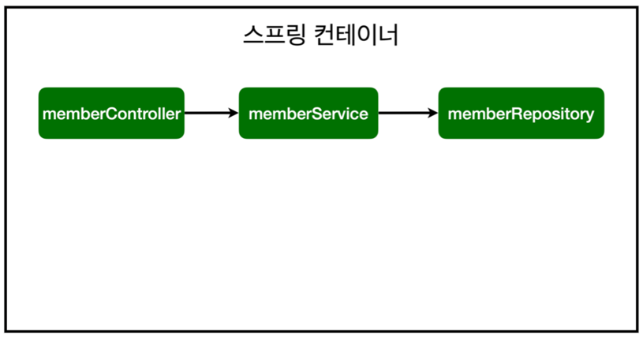
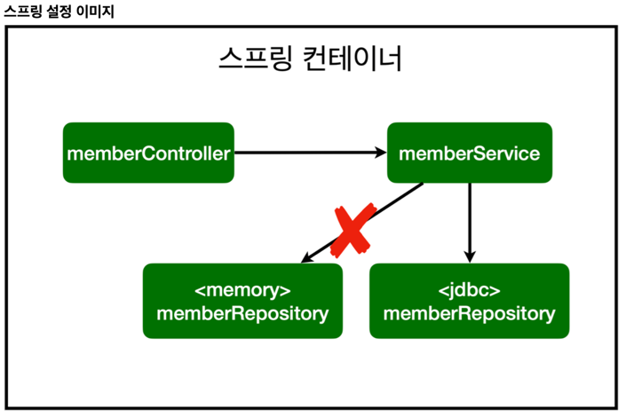

# 회원 관리 예제

## 일반적인 웹 애플리케이션 계층 구조

컨트롤러: 웹 MVC의 컨트롤러 역할
서비스: 핵심 비즈니스 로직 구현
    - 서비스 네이밍은 비즈니스에 가까운 용어를 사용해야 함.
리포지토리: 데이터베이스에 접근, 도메인 객체를 DB에 저장하고 관리
    - 기계적인/개발적인 용어를 사용 (ex. findByName)
도메인: 비즈니스 도메인 객체, 예) 회원, 주문, 쿠폰 등등 주로 데이터베이스에 저장하고 관리됨

### 클래스 의존관계

- 아직 데이터 저장소가 선정되지 않아서, 우선 인터페이스로 구현 클래스를 변경할 수 있도록 설계 
- 데이터 저장소는 RDB, NoSQL 등등 다양한 저장소를 고민중인 상황으로 가정
- 개발을 진행하기 위해서 초기 개발 단계에서는 구현체로 가벼운 메모리 기반의 데이터 저장소 사용

## 비즈니스 요구사항 정리
- 데이터: 회원ID, 이름
- 기능: 회원 등록, 조회
- 아직 데이터 저장소가 선정되지 않음(가상의 시나리오)

## 테스트 작성
- @AfterEach : 한번에 여러 테스트를 실행하면 메모리 DB에 직전 테스트의 결과가 남을 수 있다. 이렇게 되면 다음 이전 테스트 때문에 다음 테스트가 실패할 가능성이 있다. @AfterEach 를 사용하면 각 테스트가 종료될 때 마다 이 기능을 실행한다. 여기서는 메모리 DB에 저장된 데이터를 삭제한다.
- 테스트는 각각 독립적으로 실행되어야 한다. 테스트 순서에 의존관계가 있는 것은 좋은 테스트가 아니다.

## 스프링 빈과 의존관계
- 스프링을 실행하면 스프링 컨테이너라는 통이 하나 띄워짐
- @Controller (정확히는 Component) 어노테이션이 있으면 MemberController라는 객체를 "단 하나" 생성해서 컨테이너에 넣어준 후 관리함 (스프링에서는 Bean이 관리된다는 표현을 씀)
- 이렇게 빈에 객체를 등록해두면 생성자에서 @Autowired를 사용할 때, 스프링이 연관된 객체를 스프링 컨테이너에서 찾아서 넣어준다. 이러한 객체 의존관계를 외부에서 넣어주는 것을 DI (Dependency Injection), 의존성 주입이라 한다.

- 스프링은 스프링 컨테이너에 스프링 빈을 등록할 때, 기본으로 싱글톤으로 등록한다(유일하게 하나만 등록해서 공유한다) 따라서 같은 스프링 빈이면 모두 같은 인스턴스다. 설정으로 싱글톤이 아니게 설정할 수 있지만, 특별한 경우를 제외하면 대부분 싱글톤을 사용한다.

### 스프링 빈을 등록하는 2가지 방법

#### 컴포넌트 스캔과 자동 의존관계 설정 
- @Component 애노테이션이 있으면 스프링 빈으로 자동 등록된다.
- @Controller 컨트롤러가 스프링 빈으로 자동 등록된 이유도 컴포넌트 스캔 때문이다.
- @Component 를 포함하는 다음 애노테이션도 스프링 빈으로 자동 등록된다. 
  - @Controller
  - @Service
  - @Repository
    
#### 자바 코드로 직접 스프링 빈 등록하기
- @Configuration을 통해 등록한다. (SpringConfig 파일 참고)
- XML로 설정하는 방식도 있지만 최근에는 잘 사용하지 않으므로 생략한다.
- DI에는 필드 주입, setter 주입, 생성자 주입 이렇게 3가지 방법이 있다. 의존관계가 실행중에 동적으로 변하는 경우는 ~~거의~~(사실상 아예) 없으므로 **생성자 주입을 권장한다.**
- 실무에서는 주로 정형화된 컨트롤러, 서비스, 리포지토리 같은 코드는 컴포넌트 스캔을 사용한다. 그리고 정형화 되지 않거나, 상황에 따라 구현 클래스를 변경해야 하면 설정을 통해 스프링 빈으로 등록한다.
> 주의: @Autowired 를 통한 DI는 helloController , memberService 등과 같이 스프링이 관리하는 객체에서만 동작한다. 스프링 빈으로 등록하지 않고 내가 직접 생성한 객체에서는 동작하지 않는다.

## 스프링 DB 접근 기술 
### 스프링 데이터 엑세스
- H2 데이터베이스 설치 
- 순수 Jdbc 
  - 애플리케이션 서버와 데이터베이스를 연결할 때 사용하는 기술
- 스프링 통합 테스트 스프링 
- JdbcTemplate JPA
  - 스프링이 중복을 모두 제거한 기술
  - 애플리케이션에서 데이터베이스로 sql을 편하게 날릴 수 있음
- 스프링 데이터 JPA
  - JPA라는 기술이 DB에 등록/삭제/수정 쿼리를 직접 만들어서 날려줌
  - 객체를 DB에 쿼리 없이 날릴 수 있게 해줌

### 스프링 설정 변경
- DataSource는 데이터베이스 커넥션을 획득할 때 사용하는 객체다. 스프링 부트는 데이터베이스 커넥션 정보를 바탕으로 DataSource를 생성하고 스프링 빈으로 만들어둔다. 그래서 DI를 받을 수 있다.
  
- 개방-폐쇄 원칙(OCP, Open-Closed Principle)
  - 확장에는 열려있고, 수정, 변경에는 닫혀있다.
- 스프링의 DI (Dependencies Injection)을 사용하면 **기존 코드를 전혀 손대지 않고, 설정만으로 구현 클래스를 변경할 수 있다.**

### 스프링 통합 테스트
- `@SpringBootTest` : 스프링 컨테이너와 테스트를 함께 실행한다.
- `@Transactional` : **테스트 케이스에 이 애노테이션이 있으면** (프로덕션에서는 정상적으로 들어감), 테스트 시작 전에 트랜잭션을 시작하고, 테스트 완료 후에 항상 롤백한다. 이렇게 하면 DB에 데이터가 남지 않으므로 다음 테스트에 영향을 주지 않는다.

> 자바의 순수 Memory로 (자바 코드로 최소한의 단위를) 테스트한 것은 단위 테스트이고 스프링 컨테이너랑 DB까지 연동한 테스트를 통합 테스트라 한다.  
> 이때 순수한 단위 테스트가 훨씬 좋은 테스트이다. 스프링 컨테이너 없이 테스트할 수 있도록 훈련하는 것이 좋음.  
> 스프링 컨테이너를 올려야 하는 상황이라면? 설계가 잘못되었을 확률이 높다!

### 스프링 JdbcTemplate
- 스프링 JdbcTemplate과 MyBatis 같은 라이브러리는 JDBC API에서 본 반복 코드를 대부분 제거해준다. 하지만 SQL은 직접 작성해야 한다.
